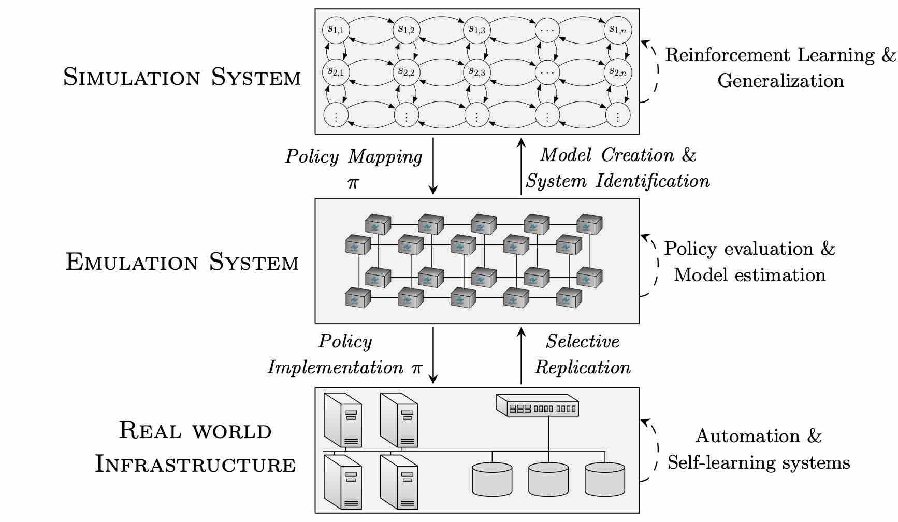
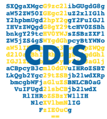

    
    
    
     
     
     
     
    
    
    
    

<!---
img src="https://badges.toozhao.com/badges/01HCESS7WXTT0T5ANET1CG9GDY/blue.svg" alt="Count">
-->

# The Cyber Security Learning Environment (CSLE)

CSLE is a platform for evaluating and developing reinforcement learning agents for control problems in cyber security.
It can be considered as a cyber range specifically designed for reinforcement learning agents. Everything from network
emulation, to simulation and implementation of network commands have been co-designed to provide an environment where it
is possible to train and evaluate reinforcement learning agents on practical problems in cyber security. The platform
can also be used to combine reinforcement learning with other quantitative methods, e.g., dynamic programming,
computational game theory, evolutionary methods, causal inference, and general optimization.

# Main Features

### 🖥️ **Emulation System**

CLSE includes a system for emulating large scale IT infrastructures, cyber attacks, and client populations. It is based
on Linux containers and can be used to collect traces and to evaluate security policies.

> **Note**
> The emulation system is mainly designed to run on a distributed system, e.g., a compute cluster.
> It can run on a laptop as well, but then only small emulations can be created.

### 💭 **Simulation System**

CSLE includes a simulation system for executing reinforcement learning algorithms and simulating Markov decision
processes and Markov games. It is built in Python and can be integrated with standard machine learning libraries.

> **Note**
> The simulations are compatible with OpenAI Gym/Gymnasium. Hence you can integrate the simulations
> with your own implementations of reinforcement learning algorithms.

### ⚙️ **Management System**

CSLE includes a system for managing emulations and simulations which can be accessed either through Command-Line
Interface (CLI), through a REST API, through Python libraries, or through a web interface. The management system allows
a) to start/stop emulations/simulations; b) real-time monitoring of emulation and simulation processes; and c), shell
access to components of emulations.

## 🎓 Documentation

Documentation, installation instructions, and usage examples are available [here](https://limmen.dev/csle/). A PDF
version of the documentation is available [here](./releases/).
A video walkthrough of the installation process is available [here](https://www.youtube.com/watch?v=l_g3sRJwwhc).

## 📋 Supported Releases

| Release                                                       | Last date of support |
|---------------------------------------------------------------|----------------------|
| [v.0.7.0](https://github.com/Limmen/csle/releases/tag/v0.7.0) | 2025-03-01           |
| [v.0.6.0](https://github.com/Limmen/csle/releases/tag/v0.6.0) | ~~2024-12-24~~       |
| [v.0.5.0](https://github.com/Limmen/csle/releases/tag/v0.5.0) | ~~2024-06-02~~       |
| [v.0.4.0](https://github.com/Limmen/csle/releases/tag/v0.4.0) | ~~2024-02-07~~       |
| [v.0.3.0](https://github.com/Limmen/csle/releases/tag/v0.3.0) | ~~2024-01-17~~       |
| [v.0.2.0](https://github.com/Limmen/csle/releases/tag/v0.2.0) | ~~2023-10-30~~       |
| [v.0.1.0](https://github.com/Limmen/csle/releases/tag/v0.1.0) | ~~2023-06-06~~       |

Maintenance releases have a stable API and dependency tree, and receive bug fixes and critical improvements but not new
features. We currently support each release for a window of 6 months.

## 📈 Build Status

| Workflow                                                                                                                                     | Status                                                                                                                  |
|----------------------------------------------------------------------------------------------------------------------------------------------|-------------------------------------------------------------------------------------------------------------------------|
| [csle-agents](https://github.com/Limmen/csle/actions/workflows/python-csle-agents-build.yml)                                                 |                       |
| [csle-attacker](https://github.com/Limmen/csle/actions/workflows/python-csle-attacker-build.yml)                                             |                     |
| [csle-collector](https://github.com/Limmen/csle/actions/workflows/python-csle-collector-build.yml)                                           |                    |
| [csle-common](https://github.com/Limmen/csle/actions/workflows/python-csle-common-build.yml)                                                 |                       |
| [csle-defender](https://github.com/Limmen/csle/actions/workflows/python-csle-defender-build.yml)                                             |                     |
| [csle-ryu](https://github.com/Limmen/csle/actions/workflows/python-csle-ryu-build.yml)                                                       |                          |
| [csle-base](https://github.com/Limmen/csle/actions/workflows/python-csle-base-build.yml)                                                     |                         |
| [csle-system-identification](https://github.com/Limmen/csle/actions/workflows/python-csle-system-identification-build.yml)                   |        |
| [gym-csle-stopping-game-build](https://github.com/Limmen/csle/actions/workflows/python-gym-csle-stopping-game-build.yml)                     |            |
| [gym-csle-intrusion-response-game-build](https://github.com/Limmen/csle/actions/workflows/python-gym-csle-intrusion-response-game-build.yml) |  |
| [python-linter](https://github.com/Limmen/csle/actions/workflows/python-linter.yml)                                                          |                                  |
| [csle-tolerance-build](https://github.com/Limmen/csle/actions/workflows/python-csle-tolerance-build.yml)                                     |                    |
| [gym-csle-apt-game-build](https://github.com/Limmen/csle/actions/workflows/python-gym-csle-apt-game-build.yml)                               |                 |
| [gym-csle-cyborg-build](https://github.com/Limmen/csle/actions/workflows/python-gym-csle-cyborg-build.yml)                                   |                   |
| [csle-attack-profiler-build](https://github.com/Limmen/csle/actions/workflows/python-csle-attack-profiler-build.yml)                         |              |
| [management-system](https://github.com/Limmen/csle/actions/workflows/js-management-system-build)                                             |                     |

## Supported Platforms

## Datasets

A dataset of 6400 intrusion traces can be found [here](https://zenodo.org/records/10234379).

## Maintainer

<table>
  <tbody>
    <tr>
      <td align="center" valign="top" width="14.28%"><a href="https://limmen.dev"> <b>Kim Hammar</b></a> <kimham@kth.se></td>
    </tr>
  </tbody>
</table>

## 🧑‍🤝‍🧑 Contribute

Contributions are very welcome. Please use GitHub issues and pull requests. See
the [documentation](https://limmen.dev/csle/) for further instructions.

### List of Contributors :star2:

Thanks go to these people!

<table>
  <tbody>
    <tr>
      <td align="center" valign="top" width="14.28%"><a href="https://limmen.dev"> <b>Kim Hammar</b></a></td>
      <td align="center" valign="top" width="14.28%"><a href="https://www.kth.se/profile/stadler"> <b>Rolf Stadler</b></a></td>
      <td align="center" valign="top" width="14.28%"><a href="https://www.kth.se/profile/pontusj"> <b>Pontus Johnson</b></a></td>
      <td align="center" valign="top" width="14.28%"><a href="https://github.com/FredericoNesti"> <b>Antonio Frederico Nesti Lopes</b></a></td>
      <td align="center" valign="top" width="14.28%"><a href="https://se.linkedin.com/in/jakob-stymne"> <b>Jakob Stymne</b></a></td>
    </tr>
    <tr>
      <td align="center" valign="top" width="14.28%"><a href="https://github.com/arvid123"> <b>Arvid Lagerqvist</b></a></td>
      <td align="center" valign="top" width="14.28%"><a href="https://github.com/nforsg"> <b>Nils Forsgren</b></a></td>
      <td align="center" valign="top" width="14.28%"><a href="https://github.com/foroughsh"> <b>Forough Shahab Samani</b></a></td>
      <td align="center" valign="top" width="14.28%"><a href="https://github.com/ppplbngth"> <b>Bength Roland Pappila</b></a></td>
      <td align="center" valign="top" width="14.28%"><a href="https://github.com/Yuhu-kth"> <b>Yu Hu</b></a></td>
    </tr>
    <tr>
       <td align="center" valign="top" width="14.28%"><a href="https://github.com/kingxiaofire"> <b>Yan Wang</b></a></td>
       <td align="center" valign="top" width="14.28%"><a href="https://github.com/Awsnaser"> <b>Aws Jaber</b></a></td>
    </tr>
  </tbody>
</table>

## 🔖 Copyright and license

<a href="./LICENSE.md">Creative Commons (C) 2020-2025, Kim Hammar</a>

## See also

- [gym-idsgame](https://github.com/Limmen/gym-idsgame)
- [gym-optimal-intrusion-response](https://github.com/Limmen/gym-optimal-intrusion-response)
- [awesome-rl-for-cybersecurity](https://github.com/Limmen/awesome-rl-for-cybersecurity)

---

Made with &#10084; &nbsp;
at &nbsp; 
&nbsp;,
&nbsp;
and
&nbsp;

