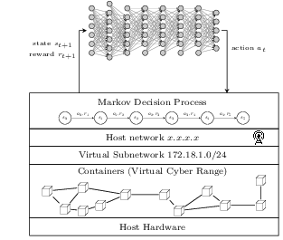

# `pycr` The Python Cyber Range for Self-Learning Cyber Security Systems

The environment implements virtual cyber rangs for training reinforcement learning agnets. 
The environment exposes a Markov-game or Markov Decision Process API for OpenAI Gym.

## Architecture

## Author & Maintainer

Kim Hammar <kimham@kth.se>

## Copyright and license

[LICENSE](LICENSE.md)

Creative Commons

(C) 2020, Kim Hammar

