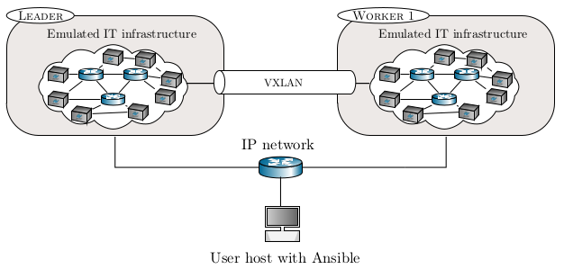

# Ansible installation

CSLE can be installed in two ways: (1) by manually executing the installation commands described in the documentation; and
(2) through Ansible. The recommended way to install CSLE is with Ansible as it automates repetitive tasks and simplifies management of the installation.
This folder contains configuration files and ansible playbooks for installing CSLE.

A video walkthrough of the installation process is available [here](https://www.youtube.com/watch?v=l_g3sRJwwhc). 

Ansible documentation can be found at [https://docs.ansible.com/](https://docs.ansible.com/).

## Network topology for the installation

The network topology for a typical Ansible installation is shown in the figure below -- the user runs Ansible on its local host and installs CSLE on a cluster of remote hosts.

<p align="center">

</p>

## Installing Ansible

Ansible can be installed by running the command:
```bash
pip install ansible
```

## Setup SSH keys

Before starting the installation, make sure to setup SSH key pairs on all of the servers where CSLE will be installed
and make sure that you can reach all of those servers from the workstation/laptop where the ansible playbooks will be run.
To generate an ssh key pair on a server, run the command `ssh-keygen`. Once keys have been created on all hosts, 
copy the public key (e.g., `~/.ssh/id_rsa.pub`) of each host to the file `.ssh/authorized_keys` of the other hosts.
After creating the SSH keys and verifying the connections, define the path to the private key of the host from which
the installation will run in the file [ansible.cfg](ansible.cfg).

## Configuring the installation

Before starting the CSLE installation, do the following.

1. Specify the leader and the worker hosts in [inventory](inventory)
2. Configure installation variables (e.g., the user of the installation and the Python version) in [group_vars/all/variables.yml](group_vars/all/variables.yml).
3. Specify the ports in [nginx_configuration_content.txt](nginx_configuration_content.txt) and [nginx_configuration_content_https.txt](nginx_configuration_content_https.txt)

After completing the configuration you can verify that your host can reach the servers where CSLE will be installed 
by running the commands:

```bash
ansible all -m ping
ansible all --list-hosts
```

You can list details about the servers by running the command:
```bash
ansible all -m gather_facts
```

## Installing CSLE
To install CSLE with ansible, run the following playbook:

```bash
ansible-playbook --ask-become-pass install.yml
```
Alternatively, you can run each playbook manually by executing the commands:
```bash
ansible-playbook --ask-become-pass install_setup.yml
ansible-playbook --ask-become-pass install_metastore.yml
ansible-playbook --ask-become-pass install_metastore_leader.yml
ansible-playbook --ask-become-pass install_simulation_system.yml
ansible-playbook --ask-become-pass install_simulation_system_leader.yml
ansible-playbook --ask-become-pass install_emulation_system.yml
ansible-playbook --ask-become-pass install_emulation_system_leader.yml
ansible-playbook --ask-become-pass install_emulation_system_worker.yml
ansible-playbook --ask-become-pass install_management_system.yml
ansible-playbook --ask-become-pass install_management_system_leader.yml
ansible-playbook --ask-become-pass start.yml
```

### Debugging

If the installation fails at some step, you can debug the reason for the failure as follows.  
Start by registering a variable that holds a dictionary of the output for the module in the task that failed (`git_installation` in the example below). 
After registering the variable, add it to the debug group. 

```bash
- name: Installation of git
    apt:
      name: git
    register: git_installation
- debug:
    var: git_installation
```

## Author & Maintainer

Kim Hammar <kimham@kth.se>

Forough Shahab <foro@kth.se>

## Copyright and license

[LICENSE](../LICENSE.md)

Creative Commons

(C) 2020-2025, Kim Hammar
