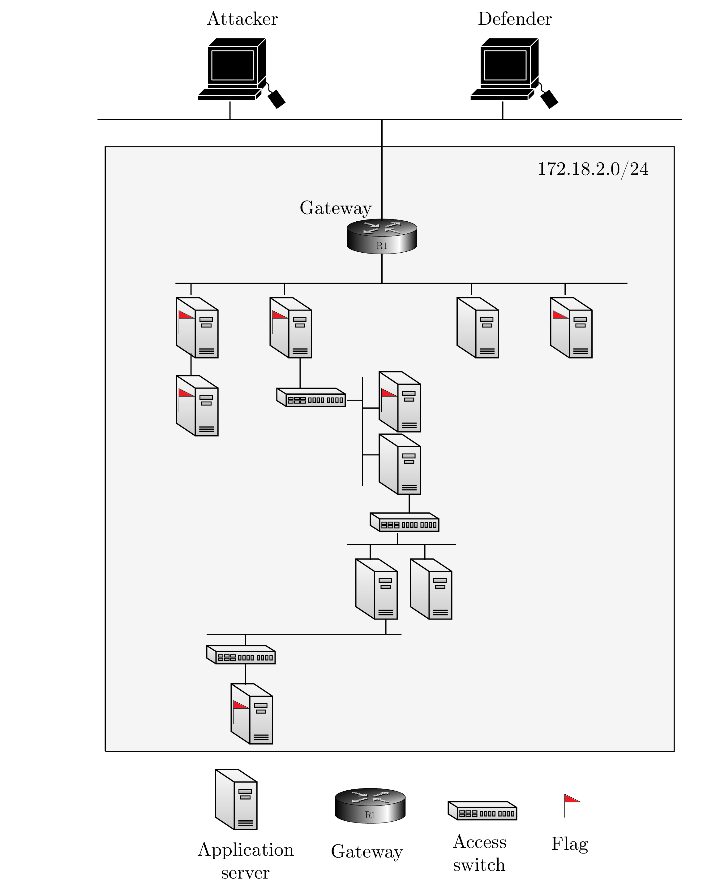

# Password Cracking - Level 2

A virtual environment with a set of nodes that run common networked services such as SSH, FTP, Telnet, IRC, Kafka, 
Cassandra, etc. Some of the services are vulnerable to simple dictionary attacks as they use weak passwords. 
The task of an attacker agent is to identify the vulnerabilities and exploit them and discover hidden flags
on the nodes. Conversely, the task of the defender is to harden the defense of the nodes and to detect the 
attacker. 

- Number of nodes: 12
- IDS: No
- Traffic generation: No
- Number of flags: 6
- Vulnerabilities: SSH, FTP, Telnet servers that can be compromised using dictionary attacks

## Architecture
<p align="center">

</p>


## Useful commands

```bash
make rm-image # Delete all built images
make build # Build all docker images
make clean # Stop all running containers
make run # Run all containers
make router # Run router container
make ssh # Run ssh container
make telnet # Run telnet container
make honeypot # Run honeypot container
make net # Create Docker sub-network
make rm-net # Remove Docker sub-network
python run.py --build # build all containers with custom config
python run.py --run # run all containers with custom config
docker container ls --all # list all running containers
docker image ls --all # list all images
docker system prune # remove unused images and containers
docker container prune # remove stopped containers   
```

## Author & Maintainer

Kim Hammar <kimham@kth.se>

## Copyright and license

[LICENSE](LICENSE.md)

Creative Commons

(C) 2020, Kim Hammar