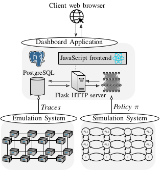

# PyCR Demos

This directory includes apps and scripts for demonstrating self-learning systems for cyber security that have been
built using `pycr`.  

## Intrusion Prevention through Optimal Stopping

A webapp demonstrating automated intrusion prevention through optimal stopping

<p align="center">

</p>

## Architecture

<p align="center">

</p>

## Useful scripts

Start the `pycr_anip` webapp:
```bash
./install_pycr_anip.sh  # Installs the PyCR Anip webapp
cd pycr_anip/server
nohup python server.py & # Deploys the PyCR Anip webbapp
```

When everything is running, use the following command to setup tunnels:
```bash
ssh -L 8888:localhost:8888 kim@<server-ip>
```
then you can access PyCr Anip at `localhost:2385`

## Note

Note that if you have started the pycr_monitor but cannot access the app from a SSH tunnel, you may need to
edit `pycr_anip/server/server.py` and update the hostname (e.g. `0.0.0.0` instead of `localhost`).

## Author & Maintainer

Kim Hammar <kimham@kth.se>

## Copyright and license

[LICENSE](../../LICENSE.md)

Creative Commons

(C) 2020, Kim Hammar