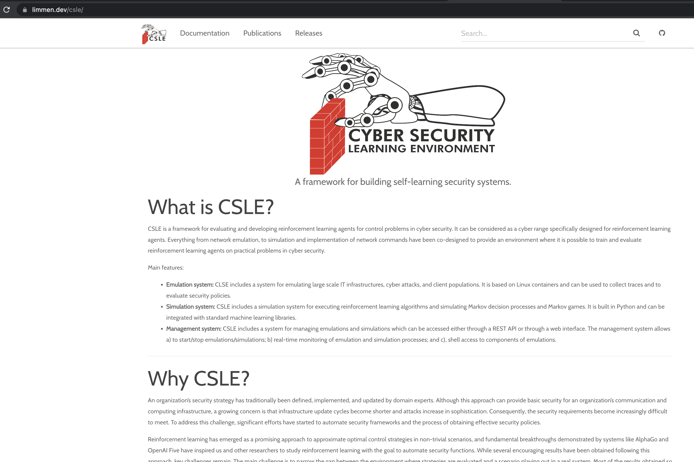

# CSLE Documentation Page

This directory contains the code of the documentation page for CSLE. It is built on top on Jekyll.

The live documentation page is available [here](https://limmen.dev/csle).

<p align="center">

</p>

## Running locally

You need Ruby and gem before starting, then:

```bash
# Install the ruby bundler
gem install bundler

# Configure the bundler
bundle config set --local path 'vendor/bundle'

# Install dependencies
bunde install

# Run jekyll with dependencies
bundle exec jekyll serve
```
You can the nfind the page at [http://127.0.0.1:4000/csle/](http://127.0.0.1:4000/csle/)
## Author & Maintainer

Kim Hammar <kimham@kth.se>

## Copyright and license

[LICENSE](../LICENSE.md)

Creative Commons

(C) 2020-2025, Kim Hammar