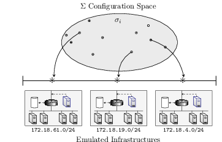

# Emulation Environments

This directory contains scripts, configurations, and tools related to emulation environments of `pycr`. Specifically:

- **Base images** ([base images](./base_images)): this directory contains base Docker images for emulating computer infrastructures.
- **Derived images** ([derived images](./derived_images)): this directory contains derived (from the base images) Docker images for emulating computer infrastructures.
- **Networks** ([networks](./networks)): this directory contains scripts for creating virtual subnetworks of Linux containers.
- **Management** ([management](./management)): this directory contains scripts and tools for managing emulated infrastructures (e.g. monitoring, starting, stopping, listing, etc.)
- **Minigames** ([minigames](./minigames)): this directory contains scripts and tools for starting/stopping specific emulation configurations (so called mini-games)
- **Supergames** ([supergames](./supergames)): this directory contains scripts and tools for starting/stopping combinations of different emulation configurations (so called mini-games)    

<p align="center">

</p>

## Installation

The emulations are built around Docker containers and virtual networking. A prerequisite is to have Docker installed:

```bash
sudo apt-get update
sudo apt-get install docker-ce docker-ce-cli containerd.io
sudo groupadd docker
sudo usermod -aG docker $USER
```

See the latest documentation for installation here: 

- ([installation guide](https://docs.docker.com/engine/install/ubuntu/))
- ([post-installation guide](https://docs.docker.com/engine/install/linux-postinstall/))

## Author & Maintainer

Kim Hammar <kimham@kth.se>

## Copyright and license

[LICENSE](../LICENSE.md)

Creative Commons

(C) 2020, Kim Hammar