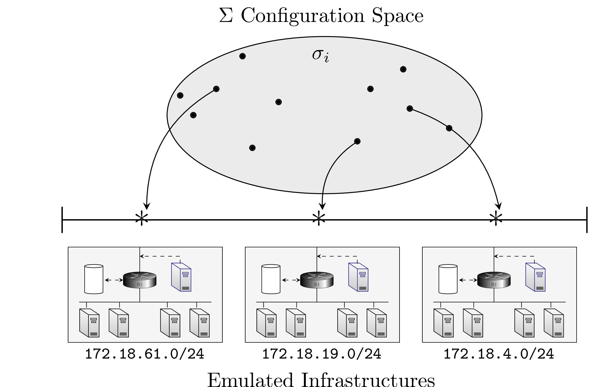

# CSLE Emulation System

This directory contains scripts, configurations, and tools related to emulation environments of `csle`. Specifically:

- **Base images** ([base images](./base_images)): this directory contains base Docker images for emulating computer infrastructures.
- **Derived images** ([derived images](./derived_images)): this directory contains derived (from the base images) Docker images for emulating computer infrastructures.
- **Environments** ([envs](./envs)): this directory contains pre-configured emulation environments

> **Note**
> The emulation system is mainly designed to run on a distributed system, e.g. a compute cluster.
> It can run on a laptop as well, but then only small emulations can be created.

<p align="center">

</p>

## Installation
To install the emulation system, follow the instructions below.

### Install and setup Docker

The emulations are built around Docker containers and virtual networking. 
A prerequisite is to have Docker installed:

```bash
sudo apt-get update
sudo apt-get install docker-ce docker-ce-cli containerd.io
sudo groupadd docker
sudo usermod -aG docker $USER
```

See the latest documentation for installation here: 

- ([installation guide](https://docs.docker.com/engine/install/ubuntu/))
- ([post-installation guide](https://docs.docker.com/engine/install/linux-postinstall/))

It is recommended to enable swap limits in the kernel. To do that, follow these intructions:
1. Log into the Ubuntu or Debian host as a user with sudo privileges.
2. Edit the `/etc/default/grub` file. Add or edit the `GRUB_CMDLINE_LINUX` line to add the following two key-value pairs:
```bash
GRUB_CMDLINE_LINUX="cgroup_enable=memory swapaccount=1"
```
Save and close the file.
3. Update GRUB.
```bash
sudo update-grub
```
4. The changes take effect when the system is rebooted.

### Setup maximum file descriptors
If have a large server and pĺan on running several emulations in paralell, it is recommended to to increase 
the limit on the number of open file descriptors since the Kafka cluster for each emulation will use quite 
a lot of desciptors. To do this, follow the steps below:
```
ulimit -Sn # check the soft limit
ulimit -Hn # check the hard limit
sudo emacs -nw /etc/security/limits.conf # open the limits conf file

# (Example) add the lines:
kim             soft       nofile          102400
kim             hard       nofile          1024000
```

### Install Open vSwitch (OVS)  for SDN emulations

To install openvswitch, run:
```bash
sudo apt install -y openvswitch-switch
```

### Install Emulation System

The emulation system consists of three parts: (1) base docker images; (2) derived docker images; 
and (3) bemulation environment configurations.

To install everything with one command, run:
```bash
make install
```

Alternatively, follow the instructions below to install each component of the emulation system separately.

For more detailed information about installation of images, see ([README](./base_images/README.MD)),
([README](./derived_images/README.MD)) and ([README](./envs/README.md)),

#### Install Base Docker images

To install the base docker images, you have two options: (i) pull the images from DockerHub; 
or (ii), build the images locally.
To build the images locally, run (this may take a while, e.g. an hour):
```bash
cd base_images
make build
cd ../
```     
> **Warning**
> Installing base images locally can take several hours


To pull the base images from DockerHub, run:
```bash
cd base_images
make pull
cd ../
```

#### Install Derived Docker images

To install the derived docker images, you have two options: (i) pull the images from DockerHub; or (ii), build the images locally.
To build the images locally, run (this may take a while, e.g. an hour):
```bash
cd derived_images
make build
cd ../
```     
To pull the derived images from DockerHub, run:
```bash
cd derived_images
make pull
cd ../
```

#### Install Emulation Environment Configurations

To install the emulation environment configurations, run: 

```bash
cd envs
make install
cd ../
```

### Uninstall Emulation System

To uninstall the emulation system, run:

```bash
make rm
```
Alternatively you can run:
```bash
cd envs
make uninstall
make clean_config
cd ../
cd derived_images
make rm_image
cd ../
cd base_images
make rm_image
cd ../
```

### Push to DockerHub
To push all Docker images to DockerHub, run:

```bash
make push
```

## Author & Maintainer

Kim Hammar <kimham@kth.se>

## Copyright and license

[LICENSE](../LICENSE.md)

Creative Commons

(C) 2020-2025, Kim Hammar