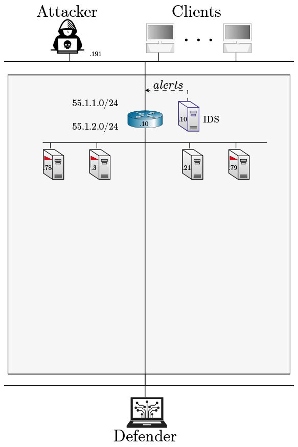

# Level 1

An emulation environment with a set of nodes that run common networked services such as SSH, FTP, Telnet, IRC, Kafka, 
etc. Some of the services are vulnerable to simple dictionary attacks as they use weak passwords. 
The task of an attacker agent is to identify the vulnerabilities and exploit them and discover hidden flags
on the nodes. Conversely, the task of the defender is to harden the defense of the nodes and to detect the 
attacker. 

- Number of nodes: 7
- IDS: No
- Traffic generation: No
- Number of flags: 3
- Vulnerabilities: SSH, FTP, Telnet servers that can be compromised using dictionary attacks
- Resources: 1 CPU 4GB RAM/Container, 1gbit/1gbit links between servers, 
100mbit/100mbit links between clients/attacker and servers
- Traffic shaping:
0.02% bursty packet loss according to the Gillbert-Elliot model between servers, and
2% bursty packet loss according to the Gillbert-Elliot model between external clients/attacker and servers,
pareto delay distribution with 0.1ms delay with 0.025ms jitter and 25% correlation between servers,
pareto delay distribution with 2ms delay with 0.5ms jitter and 25% correlation between servers and external clients/attacker,
0.0025% packet out-of-order probability between servers with 25% correlation, 
2% out-of-order probability between external clients/attacker and server with 25% correlation,
0.00001% packet duplication on all links with 25% correlation,
0.00001% packet corruption between servers and 0.02% packet corruption between external attacker/clients and the servers with 25% correlation

## Architecture
<p align="center">

</p>

## Useful commands

```bash
make install # Install the emulation in the metastore
make uninstall # Uninstall the emulation from the metastore
make clean_config # Clean config files 
docker container ls --all # list all running containers
docker image ls --all # list all images
docker system prune # remove unused images and containers
docker container prune # remove stopped containers
sudo useradd -rm -d /home/csle_admin -s /bin/bash -g root -G sudo -p "$(openssl passwd -1 'csle@admin-pw_191')" csle_admin
docker run --name=iperf3 -d --restart=unless-stopped -p 5201:5201/tcp -p 5201:5201/udp mlabbe/iperf3 # Start the iperf server on the host
iperf3 -R -c <SERVER> # network performance, where <SERVER> is the IP where the iperf server is running e.g. the host 172.31.212.92    
```

## Author & Maintainer

Kim Hammar <kimham@kth.se>

## Copyright and license

[LICENSE](../../../../../LICENSE.md)

Creative Commons

(C) 2020-2025, Kim Hammar