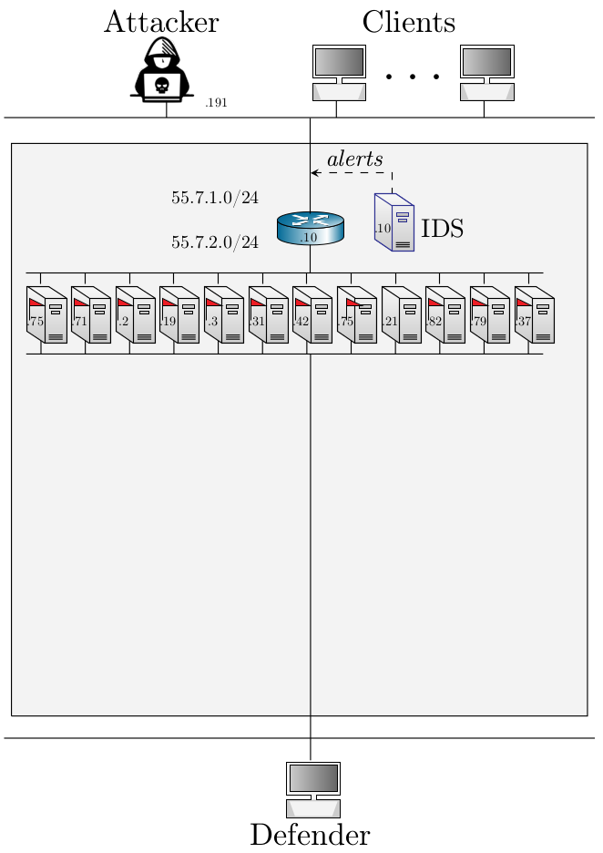

# Capture the Flag - Level 7

A virtual environment with a set of nodes that run common networked services such as SSH, FTP, Telnet, IRC, Kafka, 
Cassandra, etc. Some of the services are vulnerable to different network attacks such as the SambaCry exploit, Shellshock, CVE-2015-1427, CVE-2015-3306, CVE-2016-100033_1,and SQL injection. 
Moreover, some nodes are vulnerable to privilege escalation attacks (e.g. CVE-2010-0426 and CVE-2015-5602) which can be used by the attacker to extend his privileges after compromising the host.    
The task of an attacker agent is to identify the vulnerabilities and exploit them and discover hidden flags
on the nodes. Conversely, the task of the defender is to harden the defense of the nodes and to detect the 
attacker. 

- Number of nodes: 15
- IDS: Yes (Snort)
- Traffic generation: Yes
- Number of flags: 11
- Vulnerabilities: SambaCry, Shellshock, CVE-2015-1427, CVE-2015-3306, CVE-2016-100033_1,and SQL injection., as well as SSH, FTP, Telnet servers that can be compromised using dictionary attacks

## Architecture

<p align="center">

</p>

## Useful commands

```bash
make rm-image # Delete all built images
make build # Build all docker images
make clean # Stop all running containers
make run # Run all containers
make router # Run router container
make ssh # Run ssh container
make telnet # Run telnet container
make honeypot # Run honeypot container
make cve_2010_0426_1 # Run container with the CVE-2010-0426 vulnerability
make cve_2015_1427_1 # Run container with the CVE-2015-1427 vulnerability
make cve_2015_3306_1 # Run container with the CVE-2015-3306 vulnerability
make cve_2015_5602_1 # Run container with the CVE-2015-5602 vulnerability
make cve_2016_10033_1 # Run container with the CVE-2016-10033 vulnerability
make samba1 # Run container with th SambaCry vulnerability
make shellshock1 # Run container with the Shellshock vulnerability
make sql_injection1 # Run container with a SQL Injection vulnerability 
make net # Create Docker sub-network
make rm-net # Remove Docker sub-network
make traffic # create traffic generators and start them on each node
make stop_traffic # stop traffic_generators that are running on each node
python run.py --build # build all containers with custom config
python run.py --run # run all containers with custom config
docker container ls --all # list all running containers
docker image ls --all # list all images
docker system prune # remove unused images and containers
docker container prune # remove stopped containers
sudo useradd -rm -d /home/csle_admin -s /bin/bash -g root -G sudo -p "$(openssl passwd -1 'csle@admin-pw_191')" csle_admin   
```

## Author & Maintainer

Kim Hammar <kimham@kth.se>

## Copyright and license

[LICENSE](../../../../../../../LICENSE.md)

Creative Commons

(C) 2020, Kim Hammar