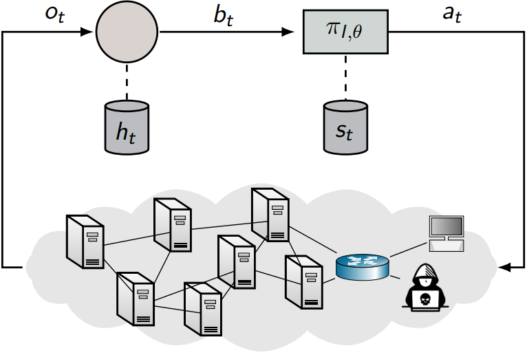

# CSLE Data Collection Examples

This directory contains example scripts for collecting data with CSLE.

## Contents

- Collecting traces: [./static_sequences](static_sequences): this directory contains example scripts for running static attacker sequences in an emulation and recording metrics in traces.
- Data exportation: [./data_exportation](data_exportation): this directory contains example scripts for exporting data from the CSLE metastore to disk.
- Data importation: [./data_importation](data_importation): this directory contains example scripts for importing data from disk to the CSLE metastore.
- Save dataset: [./save_dataset](save_dataset): this directory contains example scripts for taking data from the metastore and saving it as pre-packaged datasets in different formats.

## Author & Maintainer

Kim Hammar <kimham@kth.se>

## Copyright and license

[LICENSE](../../LICENSE.md)

Creative Commons

(C) 2020-2025, Kim Hammar