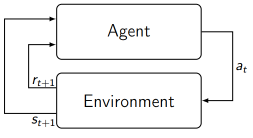

# CSLE Training Examples

This directory contains example scripts for system policy training in CSLE.

## Contents

- Bayesian Optimization: [./bayes_opt](bayes_opt): this directory contains example scripts for optimizing policies using Bayesian Optimization
- Cross Entropy: [./cross_entropy](cross_entropy): this directory contains example scripts for optimizing policies using the Cross-Entropy method
- Differential Evolution: [./differential_evolution](differential_evolution): this directory contains example scripts for optimizing policies using differential evolution.
- Deep Q-Network (DQN): [./dqn](dqn): this directory contains example scripts for optimizing policies using the DQN reinforcement learning algorithm
- DynaSec: [./dynasec](dynasec): this directory contains example scripts for optimizing policies using the DynaSec algorithm
- Fictitious Play: [./fp](fp): this directory contains example scripts for approximating Nash equilibria using Fictious Play
- Heuristic-Search Value Iteration: [./hsvi](hsvi): this directory contains example scripts for optimizing policies using HSVI
- Heuristic-Search Value Iteration for one-sided partially observed stochastic games (OS-POSGs): [./hsvi_os_posg](hsvi_os_posg): this directory contains example scripts for optimizing policies using HSVI for OS-POSGs
- Kiefer-Wolfowitz: [./kiefer_wolfowitz](kiefer_wolfowitz): this directory contains example scripts for optimizing policies using the Kiefer-Wolfowitz algorithm
- Linear programming for normal-form games: [./lp_for_nf_games](lp_for_nf_games): this directory contains example scripts for computing Nash equilibria for normal-form games using Linear programming.  
- Policy Iteration: [./pi](pi): this directory contains example scripts for optimizing policies using Policy Iteration (Dynamic Programming)
- Proximal Policy Optimization: [./ppo](ppo): this directory contains example scripts for optimizing policies using the PPO reinforcement learning algorithm
- Q-learning: [./q_learning](q_learning): this directory contains example scripts for optimizing policies using Q-learning
- Random search: [./random_search](random_search): this directory contains example scripts for optimizing policies using random search
- REINFORCE: [./reinforce](reinforce): this directory contains example scripts for optimizing policies using the REINFORCE reinforcement learning algorithm
- SARSA: [./sarsa](sarsa): this directory contains example scripts for optimizing policies using the SARSA reinforcement learning algorithms
- Shapley Iteration: [./shapley_iteration](shapley_iteration): this directory contains example scripts for computing Nash equilibria through Shapley Iteration
- Sondik's Value Iteration: [./sondik_vi](sondik_vi): this directory contains example scripts for optimizing policies using Sondik's Value iteration algorithm
- Threshold-Fictious Self-Play (T-FP): [./t_fp](t_fp): this directory contains example scripts for approximating Nash equilibria through Threshold-Fictitious-Self-Play (see [https://ieeexplore.ieee.org/document/9779345](https://ieeexplore.ieee.org/document/9779345))
- Threshold-Simultaneous-Perturbation-Stochastic-Approximation (T-SPSA): [./t_spsa](t_spsa): this directory contains example scripts for optimizing policies using T-SPSA (see [https://ieeexplore.ieee.org/document/9779345](https://ieeexplore.ieee.org/document/9779345))
- Value Iteration: [./vi](vi): this directory contains example scripts for optimizing policies using Value Iteration (Dynamic Programming)

## Author & Maintainer

Kim Hammar <kimham@kth.se>

## Copyright and license

[LICENSE](../../LICENSE.md)

Creative Commons

(C) 2020-2025, Kim Hammar