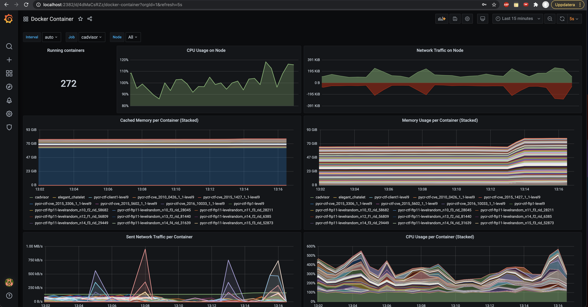

# CSLE Management System

The management system system builds on Grafana, Prometheus, Cadvisor, NodeExporter, the rest api, and the `csle-mgmt-webapp` applicaton 

## `csle-mgmt-webapp`
A webapp for managing and monitoring emulation environments created with csle

### Video demonstration

#### V0.2.0
[](https://www.youtube.com/watch?v=iE2KPmtIs2A& "The Cyber Security Learning Environment (CSLE) v.0.2.0 Demo")

#### V0.1.0
[](http://www.youtube.com/watch?v=18P7MjPKNDg "A System for Interactive Examination of Learned Security Policies - Hammar & Stadler")

## Contents
This directory includes scripts for starting Grafana+Prometheus+Cadvisor+NodeExporter for monitoring running
emulations as well as the host system. 

The directory also includes a scripts for starting a custom web-app (`csle-mgmt-webapp`) 
for keeping track of the emulation configurations.

## Grafana

Grafana is used to monitor the performance of the emulation environments

<p align="center">

</p>

<p align="center">

</p>

## Useful scripts
```bash
# Download and setup prometheus:
cd csle/management-system
wget https://github.com/prometheus/prometheus/releases/download/v2.34.0/prometheus-2.34.0.linux-amd64.tar.gz
tar -xf prometheus-2.34.0.linux-amd64.tar.gz
mv prometheus-2.34.0.linux-amd64 prometheus
rm -rf prometheus-2.34.0.linux-amd64.tar.gz
export PATH=/path/to/csle/management-system/prometheus/:$PATH`

# Download and setup node exporter:
wget https://github.com/prometheus/node_exporter/releases/download/v1.3.1/node_exporter-1.3.1.linux-amd64.tar.gz
tar -xf node_exporter-1.3.1.linux-amd64.tar.gz
mv node_exporter-1.3.1.linux-amd64 node_exporter
rm -rf node_exporter-1.3.1.linux-amd64.tar.gz
`export PATH=/path/to/csle/management-system/node_exporter/:$PATH`

./install.sh   # Installs prometheus, grafana, csle-mgmt-webapp, NodeExporter, Dashboards, C_Advisor etc.
./csle-mgmt-webapp.sh  # Installs csle-mgmt-webapp
./run_c_advisor.sh # Installs C_Advisor
./run_grafana.sh  # Installs Grafana
./run_node_exporter.sh # Installs node exporter
./run_prometheus.sh # Installs Prometheus

sudo apt install ctop
sudo npm install -g dockly
ctop # Show docker statistics
docker stats # Show docker statistics
docker container top <ID> # top command for a single container
dockly # command line interface for managing containers 


ps -aux | grep prometheus
kim       473648 30.6  0.2 3384316 1604780 pts/4 Sl   10:58   6:41 ./prometheus/prometheus --config.file=prometheus/prometheus.yml --storage.tsdb.retention.size=10GB --storage.tsdb.retention.time=5d
kim       671347  0.0  0.0   5192  2424 pts/3    S+   11:20   0:00 grep --color=auto prometheus
(base) kim@ubuntu:~/$ sudo kill -9 473648

(base) kim@ubuntu:~/$ ps -aux | grep node_exporter
kim       472901 11.0  0.0 733820 54568 pts/4    SLl  10:58   2:29 ./node_exporter/node_exporter
kim       672934  0.0  0.0   5196  2432 pts/3    S+   11:21   0:00 grep --color=auto node_exporter
(base) kim@ubuntu:~/$ sudo kill -9 472901

(base) kim@ubuntu:~/$ docker ps | grep cadvisor
67f6948b7fa6        google/cadvisor:latest        "/usr/bin/cadvisor -…"   23 minutes ago      Up 23 minutes       0.0.0.0:8080->8080/tcp                                                                           cadvisor
(base) kim@ubuntu:~/$ docker stop 67f6948b7fa6

(base) kim@ubuntu:~/$ docker rm 67f6948b7fa6
67f6948b7fa6

(base) kim@ubuntu:~/$ docker ps | grep grafana
ef0578ab2195        grafana/grafana               "/run.sh"                24 minutes ago      Up 24 minutes       0.0.0.0:3000->3000/tcp                                                                           elegant_chatelet
(base) kim@ubuntu:~/$ docker stop ef0578ab2195
(base) kim@ubuntu:~/$ docker rm ef0578ab2195

```

When importing Prometheus as a data source in Grafana, use
```bash
http://<ip>:9090
```
e.g.
```bash
http://172.31.212.92:9090
``` 

When everything is running, use the following command to setup tunnels:
```bash
ssh -L 8080:localhost:8080 -L 3000:localhost:3000 -L 9090:localhost:9090 -L 9100:localhost:9100 -L 7777:localhost:7777 kim@<server-ip>
```
then you can access Grafana at `localhost:2382`, Prometheus at `localhost:2383`, Node exporter at `localhost:2384`, and csle management system at `localhost:2385`

## Note

Note that if you have started the CSLE management system but cannot access the app from a SSH tunnel, you may need to
edit `management-system/csle-mgmt-webapp/server/server.py` and update the hostname (e.g. `0.0.0.0` instead of `localhost`).

## Author & Maintainer

Kim Hammar <kimham@kth.se>

## Copyright and license

[LICENSE](../../LICENSE.md)

Creative Commons

(C) 2020-2025, Kim Hammar