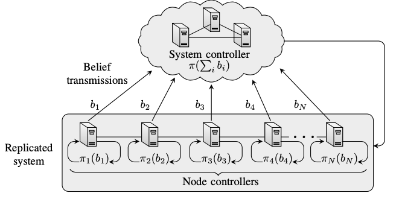

# Intrusion Tolerance MDP for the defender 

Intrusion tolerance MDP for the defender (intrusion response)

## Overview
<p align="center">

</p>

## Useful commands

```bash
make install # installs the environment in the metastore
make uninstall # uninstalls the environment from the metastore
make clean_config # cleans the materialized config file    
```

## Author & Maintainer

Kim Hammar <kimham@kth.se>

## Copyright and license

[LICENSE](../../../../../LICENSE.md)

Creative Commons

(C) 2020-2025, Kim Hammar