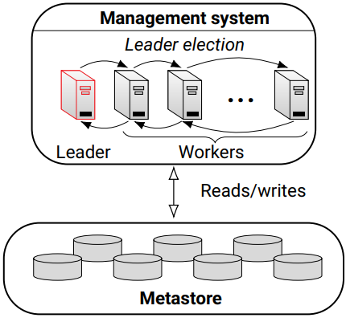

# `csle-cluster`

This library contains scripts and programs for cluster management in CSLE.  

<p align="center">

</p>

[](https://badge.fury.io/py/csle-cluster)


## Re-generate gRPC files

To re-generate the gRPC files, run: 
```bash
python -m grpc_tools.protoc -I./protos/ --python_out=./src/csle_cluster/. --grpc_python_out=./src/csle_cluster/cluster_manager/. ./protos/cluster_manager.proto
```

## Requirements

- Python 3.8+
- `csle-common`
- `csle-collector`
- `csle-ryu` 
- `grpcio` (for the cluster API)
- `grpcio-tools` (for the cluster API)

## Development Requirements

- Python 3.8+
- `flake8` (for linting)
- `tox` (for automated testing)
- `pytest` (for unit tests)
- `pytest-cov` (for unit test coverage)
- `mypy` (for static typing)
- `sphinx` (for API documentation)
- `sphinxcontrib-napoleon` (for API documentation)
- `sphinx-rtd-theme` (for API documentation)

## Installation

```bash
# install from pip
pip install csle-cluster==<version>
# local install from source
$ pip install -e csle-cluster
# or (equivalently):
make install
# force upgrade deps
$ pip install -e csle-cluster --upgrade

# git clone and install from source
git clone https://github.com/Limmen/csle
cd csle/simulation-system/libs/csle-cluster
pip3 install -e .
```

### Development tools

Install all development tools at once:
```bash
make install_dev
```

Install the Python build tool
```bash
pip install -q build
```

Install `twine` for publishing the package to PyPi:
```bash
python3 -m pip install --upgrade twine
```

Install the `flake8` linter:
```bash
python -m pip install flake8
```

Install the mypy for static type checking:
```bash
python3 -m pip install -U mypy
```

Install `pytest` and `mock` for unit tests:
```bash
pip install -U pytest mock pytest-mock pytest-cov
```

Install Sphinx to automatically generate API documentation from docstrings:
```bash
pip install sphinx sphinxcontrib-napoleon sphinx-rtd-theme
```

Install tox for automatically running tests in different python environments:
```bash
pip install tox
```

## API documentation

This section contains instructions for generating API documentation using `sphinx`.

### Latest Documentation

The latest documentation is available at [https://limmen.dev/csle/docs/csle-cluster](https://limmen.dev/csle/docs/csle-cluster)

### Generate API Documentation

First make sure that the `CSLE_HOME` environment variable is set:
```bash
echo $CSLE_HOME
```
Then generate the documentation with the commands:
```bash
cd docs
sphinx-apidoc -f -o source/ ../csle_cluster/
make html
```
To update the official documentation at [https://limmen.dev/csle](https://limmen.dev/csle), copy the generated HTML files to the documentation folder:
```bash
cp -r build/html ../../../../docs/_docs/csle-cluster
```

To run all documentation commands at once, use the command:
```bash
make docs
```

## Static code analysis

To run the Python linter, execute the following command:
```
flake8 .
# or (equivalently):
make lint
```

To run the mypy type checker, execute the following command:
```
mypy .
# or (equivalently):
make types
```

## Unit tests

To run the unit tests, execute the following command:
```
pytest
# or (equivalently):
make unit_tests
```

To generate a coverage report, execute the following command:
```
pytest --cov=csle_cluster
```

## Run tests and code analysis in different python environments

To run tests and code analysis in different python environemnts, execute the following command:

```bash
tox
# or (equivalently):
make tests
```

## Create a new release and publish to PyPi

First build the package by executing:
```bash
python3 -m build
# or (equivalently)
make build
```
After running the command above, the built package is available at `./dist`.

Push the built package to PyPi by running:
```bash
python3 -m twine upload dist/*
# or (equivalently)
make push
```

To run all commands for the release at once, execute:
```bash
make release
```


## Author & Maintainer

Kim Hammar <kimham@kth.se>

## Copyright and license

[LICENSE](LICENSE.md)

Creative Commons

(C) 2020-2023, Kim Hammar